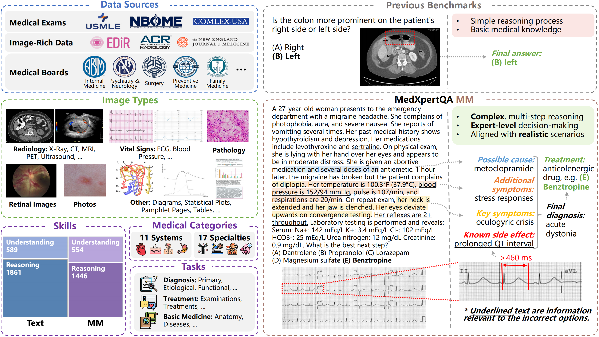
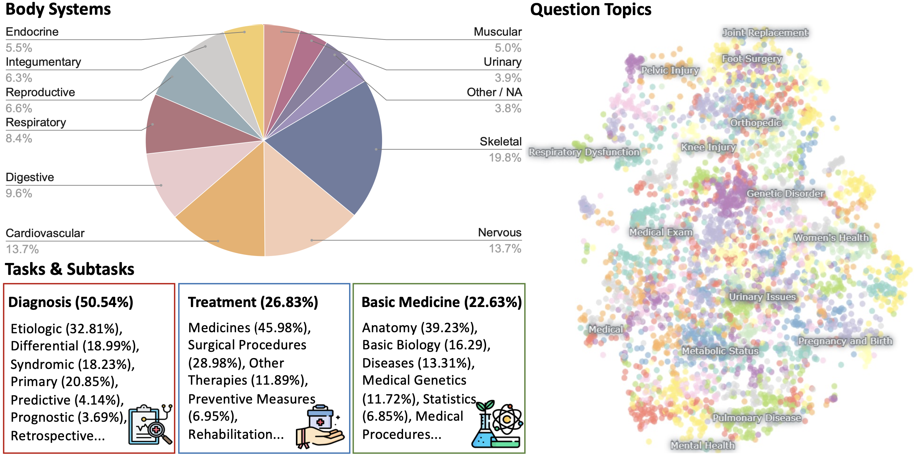
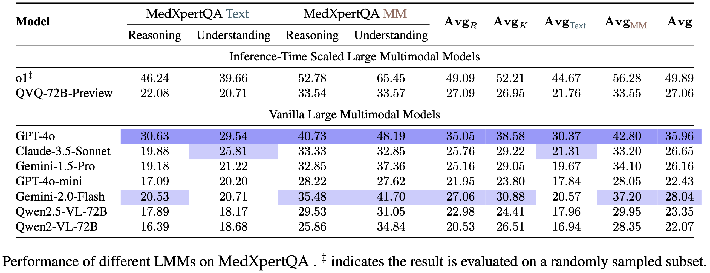
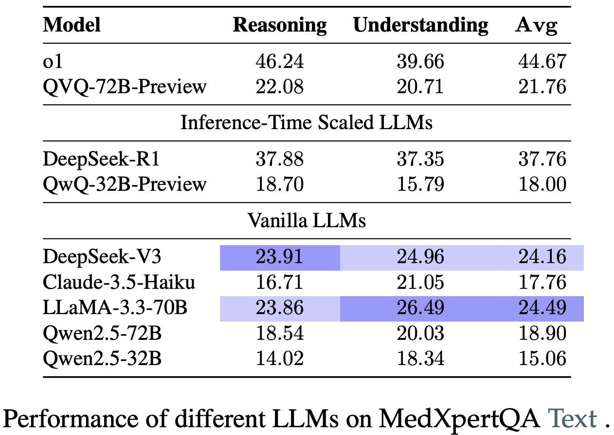

<div align="center">
<h1>
  MedXpertQA: Benchmarking Expert-Level Medical Reasoning and Understanding
</h1>
</div>

<p align="center">
  <a href="https://arxiv.org/abs/2501.18362">🤗 Dataset</a> •
  <a href="https://arxiv.org/abs/2501.18362">📃 Paper</a>
</p>

This is the official repository for the paper "MedXpertQA: Benchmarking Expert-Level Medical Reasoning and Understanding".

## 🔥 Updates

- **🔥 [2025-01-31] We introduce [MedXpertQA](https://arxiv.org/abs/2501.18362), a highly challenging and comprehensive benchmark to evaluate expert-level medical knowledge and advanced reasoning!**

## Overview

**MedXpertQA** includes 4,460 questions spanning 17 specialties and 11 body systems. It includes two subsets, **MedXpertQA Text** for text medical evaluation and **MedXpertQA MM** for multimodal medical evaluation.

The Figure presents an overview. The left side illustrates MedXpertQA's diverse data sources, image types, and question attributes. The right side compares typical examples from MedXpertQA MM and a traditional benchmark~(VQA-RAD).

<p align="center">
   
</p>


## Features

- **Next-Generation Multimodal Medical Evaluation:** MedXpert MM introduces expert-level medical exam questions with diverse images and rich clinical information, including patient records and examination results, setting it apart from traditional medical multimodal benchmarks with simple QA pairs generated from image captions.
- **Highly Challenging:** MedXpertQA introduces high-difficulty medical exam questions and applies rigorous filtering and augmentation, effectively addressing the insufficient difficulty of existing benchmarks like MedQA. The Text and MM subsets are currently the most challenging benchmarks in their respective fields.

<p align="center">
   
</p>

- **Clinical Relevance:**  MedXpertQA incorporates specialty board questions to improve clinical relevance and comprehensiveness by collecting questions corresponding to 17/25 member board exams (specialties) of the American Board of Medical Specialties. It showcases remarkable diversity across multiple dimensions.

<p align="center">
   
</p>

- **Mitigating Data Leakage:** We perform data synthesis to mitigate data leakage risk and conduct multiple rounds of expert reviews to ensure accuracy and reliability.
- **Reasoning-Oriented Evaluation:** Medicine provides a rich and representative setting for assessing reasoning abilities beyond mathematics and code. We develop a reasoning-oriented subset to facilitate the assessment of o1-like models.

## Leaderboard

We evaluate 16 leading proprietary and open-source LMMs and LLMs including advanced inference-time scaled models with a focus on the latest progress in medical reasoning capabilities.

<div style="display: flex; justify-content: center; align-items: center;">
  
  
</div>

## Contact

Shang Qu: lindsay2864tt@gmail.com
Ning Ding: dn97@mail.tsinghua.edu.cn

## Citation

If you find our work helpful, please use the following citation.

```bibtex
@article{zuo2025medxpertqa,
  title={MedXpertQA: Benchmarking Expert-Level Medical Reasoning and Understanding},
  author={Zuo, Yuxin and Qu, Shang and Li, Yifei and Chen, Zhangren and Zhu, Xuekai and Hua, Ermo and Zhang, Kaiyan and Ding, Ning and Zhou, Bowen},
  journal={arXiv preprint arXiv:2501.18362},
  year={2025}
}
```